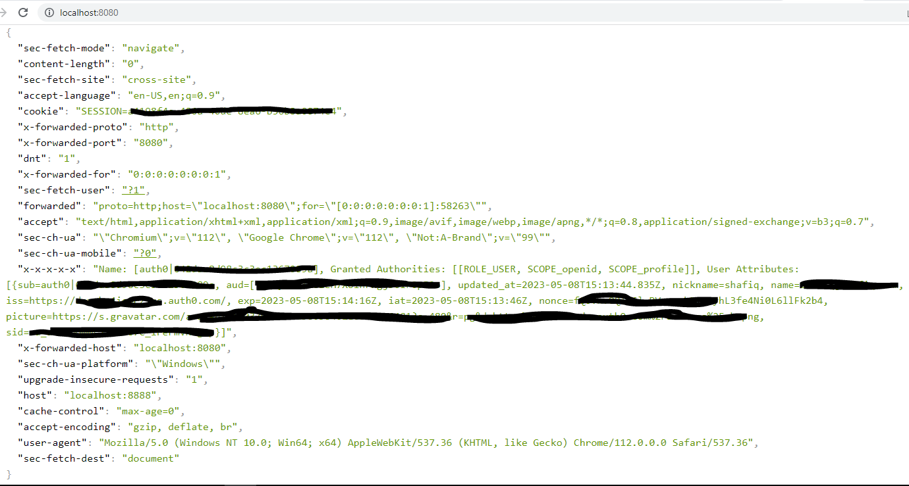

# An example of Spring Cloud Gateway as a Proxy to other Microservices

This example solves the use case where we have a centralized proxy that authenticates users.  Also forwards some headers to the downstream applications. 

## Implementation Details
This example is using one downstream application.  If we have many, we will need to change the code accordingly.  This example uses:
* Spring Cloud Gateway
* Auth0 as Oauth2/OIDC provider
* Spring Boot 2.7.11
* Java 8

## Steps to run
* Add Auth Provider (I am using Auth0) information in the application.yml of the Proxy application
* Run the Client
* Run the Proxy
* Hit the URL: `http://localhost:8080`

## Results
If all goes well, we should see this:

### Notes
We will have to add additional security to downsteam application to validate that the request came from the proxy application.  Otherwise anybody can bypass the proxy application.